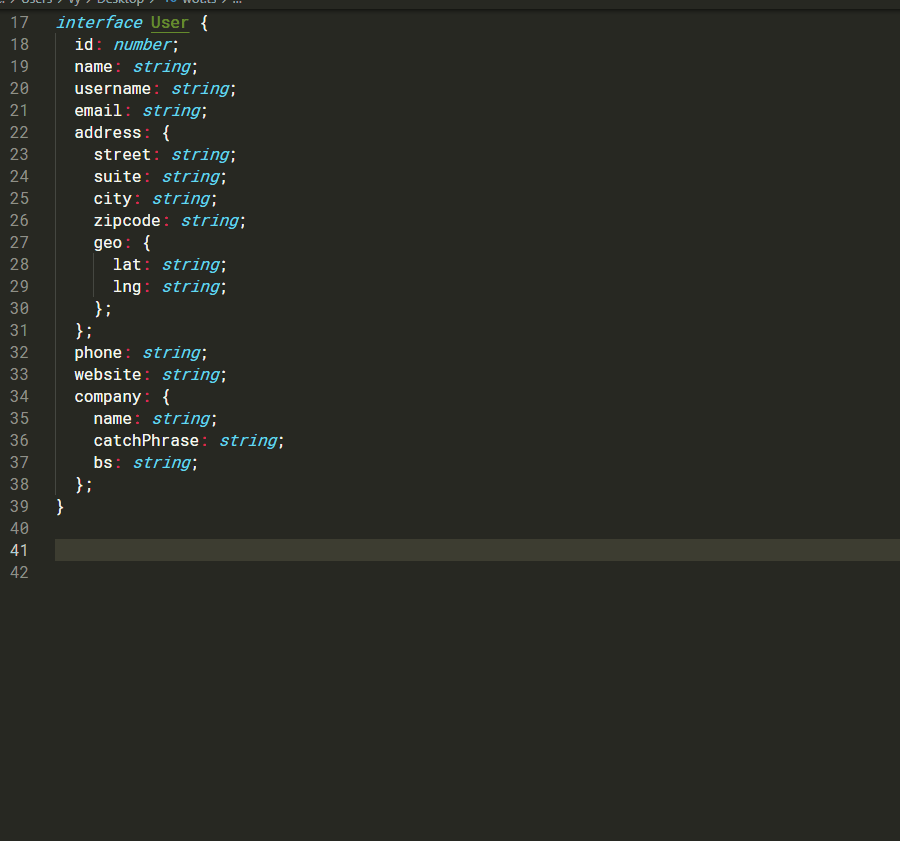

# Create object property string path generator with typescript

Wow, that was a large noun cluster. Well, what is it anyway?

Now, using some libraries/frameworks you might sometimes need to generate a string that would represent a path to a property of some object, for example when you need to perform a get on Angular's `FormGroup` or have nested form field in `React Hook Form`.

You could create several monstrous constants, ie something akin to:

```typescript
const nestedAddressField = 'user.contacts.address';
```

Or maybe use template strings and enums, but there is a better way.

Typescript 4 bring along amazing stuff: [Template Literal Types
](https://www.typescriptlang.org/docs/handbook/2/template-literal-types.html). These are the solution.

Now, using this amazing feature we can create a type with infinite recursion and a helper function to generate all possible property paths an object has for us.

Check this out. First let us create a type that would basically be a colletion of all possible string paths in an object:

```typescript
// For convenience
type Primitive = string | number | bigint | boolean | undefined | symbol;

// To infinity and beyond >:D
export type PropertyStringPath<T, Prefix=''> = {
    [K in keyof T]: T[K] extends Primitive | Array<any> 
    ? `${string & Prefix}${ string & K }` 
    : `${string & Prefix}${ string & K }` | PropertyStringPath <T[K], `${ string & Prefix }${ string & K }.`> ;
}[keyof T];
```

Basically what it does is iterating over object's properties and returning each field as a string with a given prefix. Initially the prefix is empty string, which is nothing. If it encounters a primitive or an array, it returns a string with prefix, if it encounters an object, it then invokes itself recursively, but adds a dot to the prefix. Easy-peasy.

Now what's left to do is to create a simple factory that can generate us helper functions to provide hints:

```typescript
export function propertyStringPathFactory<T, R=string>(): (path: PropertyStringPath<T>) => R {
    return (path: PropertyStringPath<T>) => (path as unknown as R);
}
```

So now instead of walking on eggshells with strings we can use helper function that safeguards us from making mistakes.

Have fun ^_^

Oh, and by the way, there's an [npm package](https://www.npmjs.com/package/property-string-path) with this utility 💪


