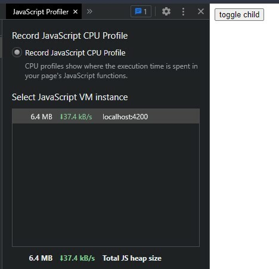
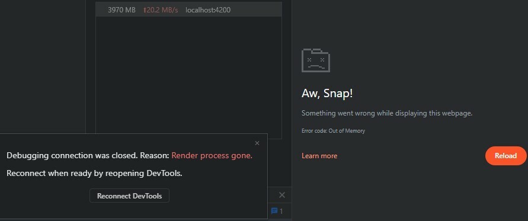
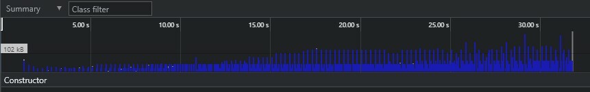
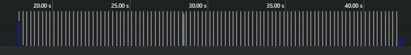

```ic-metadata
{
  "name": "The Easiest Way to Unsubscribe from Observables in Angular",
  "series": null,
  "date": "2021-12-18",
  "lastModifiedDate": "2021-12-19",
  "author": "Volodymyr Yepishev",
  "tags": ["typescript", "angular", "tutorial"],
  "canonicalLink": "https://dev.to/bwca/the-easiest-way-to-unsubscribe-from-observables-in-angular-4cg4"
}
```

# The Easiest Way to Unsubscribe from Observables in Angular

...is of course using the `async` pipe, but the article is not about it. It's about situations where you need to subscribe inside component's `ts` file and how to deal with it. This article is about dealing with repetitive logic of cancelling subscription in different components.

(The actual repo used for this article can be found [here](https://github.com/Bwca/easy-ubsubscribe-from-observable-in-angular-with-a-service))

Managing subscriptions in Angular can get quite repetitive and even imperative if you are not using the `async` pipe. The rule of thumb is if you subscribe, you should always unsubscribe. Indeed, there are finite observables which autocomplete, but those are separate cases.

In this article we will:

* create an Angular application with memory leaks caused by the absence of unsubscribing from an `Observable`;
* fix the leaks with a custom unsubscribe service.

The only things we are going to use are `rxjs` and Angular features.

Now let's create our applications and add some components. I'll be using `npx` since I don't install any packages globally.

```bash
npx @angular/cli new ng-super-easy-unsubscribe && cd ng-super-easy-unsubscribe
```

To illustrate leaks we need two more things: a service to emit infinite number of values via an `Observable` and a component that will subscribe to it, perform some memory consuming operation in subscribe function and never unsubscribe.

Then we will proceed switching it on and off to cause memory leaks and see how it goes :)

```bash
npx @angular/cli generate component careless
npx @angular/cli generate service services/interval/interval
```

As I have already stated the interval service is just for endless emissions of observables, so we'll put only `interval` there:

```typescript
// src/app/services/interval/interval.service.ts
import { Injectable } from '@angular/core';

import { interval, Observable } from 'rxjs';

@Injectable({
  providedIn: 'root',
})
export class IntervalService {
  public get getInterval(): Observable<number> {
    return interval(250);
  }
}
```

The application component is going to be busy with nothing else than toggling the `CarelessComponent` on and off, with mere 4 lines of template we can put it directly in the `ts` file:

```typescript
// src/app/app.component.ts
import { Component } from '@angular/core';

@Component({
  selector: 'app-root',
  template: `
    <section>
      <button (click)="toggleChild()">toggle child</button>
    </section>
    <app-careless *ngIf="isChildVisible"></app-careless>
  `,
  styleUrls: ['./app.component.css'],
})
export class AppComponent {
  public isChildVisible = false;

  public toggleChild(): void {
    this.isChildVisible = !this.isChildVisible;
  }
}
```

To get a better view of memory leaks it is a good idea to just dump some random string arrays into a bigger array of trash on every `Observable` emission.

```typescript
// src/app/careless/careless.component.ts
import { Component, OnInit } from '@angular/core';

import { IntervalService } from '../services/interval/interval.service';
import { UnsubscribeService } from '../services/unsubscribe/unsubscribe.service';

@Component({
  selector: 'app-careless',
  template: `<p>ಠ_ಠ</p>`,
})
export class CarelessComponent implements OnInit {
  private garbage: string[][] = [];
  public constructor(private intervalService: IntervalService) {}

  public ngOnInit(): void {
    this.intervalService.getInterval.subscribe(async () => {
      this.garbage.push(Array(5000).fill("some trash"));
    });
  }
}
```

Start the application, go to developer tools in the browser and check Total JS heap size, it is relatively small.



If in addition to piling garbage in component property you log it to console, you can crash the page pretty quickly.



Because the allocated memory is never released, it will keep adding more junk every time `CarelessComponent` instance comes to life.



So what happened? We've leaked and crashed because each toggle on cause new subscription and each toggle off did not cause any subscription cancelling to fire.

In order to avoid it we should unsubscribe when the component gets destroyed. We could place that logic in our component, or create a base component with that logic and extend it or... we can actually create a service that provides a custom `rxjs` operator that unsubscribes once the component is destroyed.

How will a service know the component is being destroyed? Normally services are provided as singletons on root level, but if we remove the `providedIn` property in the `@Injectable` decorator, we can provide the service on component level, which allows us to access `OnDestroy` hook in the service. And this is how we will know component is being destroyed, because the service will be destroyed too.

Let's do it!

```bash
npx @angular/cli generate service services/unsubscribe/unsubscribe
```

Inside the service we place the good old subscription cancelling logic with `Subject` and `takeUntil` operator:

```typescript
import { Injectable, OnDestroy } from '@angular/core';

import { Observable, Subject, takeUntil } from 'rxjs';

@Injectable()
export class UnsubscriberService implements OnDestroy {
  private destroy$: Subject<boolean> = new Subject<boolean>();

  public untilDestroyed = <T>(source$: Observable<T>): Observable<T> => {
    return source$.pipe(takeUntil(this.destroy$));
  };

  public ngOnDestroy(): void {
    this.destroy$.next(true);
    this.destroy$.unsubscribe();
  }
}
```

Note that an arrow function is used for the `untilDestroyed` method, as when used as `rxjs` operator we will lose the context unless we use arrow function.

Alternatively instead of using arrow function in a property we could also have used a getter to return an arrow function, which would look like this:

```typescript
  public get untilDestroyed(): <T>(source$: Observable<T>)=> Observable<T> {
    return <T>(source$: Observable<T>) => source$.pipe(takeUntil(this.destroy$));
  };
```

I'll go with the getter variant because I do not enjoy arrow function in class properties.

Now on to fixing our careless component, we add `UnsubscribeService` to its `providers` array, inject it into the constructor and apply its operator in our subscription pipe:

```typescript
import { Component, OnInit } from '@angular/core';

import { IntervalService } from '../services/interval/interval.service';
import { UnsubscribeService } from '../services/unsubscribe/unsubscribe.service';

@Component({
  selector: 'app-careless',
  template: `<p>ಠ_ಠ</p>`,
  providers: [UnsubscribeService],
})
export class CarelessComponent implements OnInit {
  private garbage: string[][] = [];
  public constructor(private intervalService: IntervalService, private unsubscribeService: UnsubscribeService) {}

  public ngOnInit(): void {
    this.intervalService.getInterval.pipe(this.unsubscribeService.untilDestroyed).subscribe(async () => {
      this.garbage.push(Array(5000).fill("some trash"));
    });
  }
}
```

If you go back to the application and try toggling the child component on and off you will notice that it doesn't leak anymore.



No imperative cancelling subscription logic in the component, no `async` pipes, no external packages needed.

Easy peasy lemon squeezy :)
