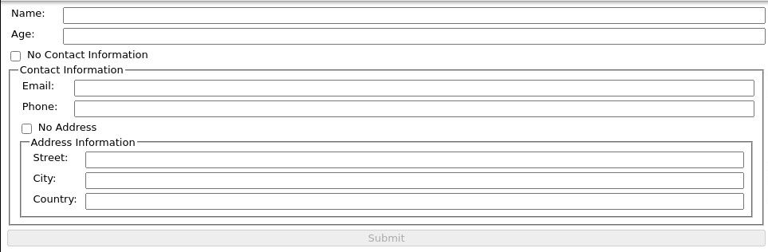

```ic-metadata
{
  "name": "Template Driving Reactive Form Validation in Angular",
  "series": null,
  "date": "2023-05-15",
  "lastModifiedDate": "2024-07-09",
  "author": "Volodymyr Yepishev",
  "tags": ["angular"],
  "canonicalLink": "https://dev.to/bwca/template-driving-reactive-form-validation-in-angular-302e"
}
```

# Template Driving Reactive Form Validation in Angular

Form validation is a huge part of good UX and a major pain in the neck for frontend developers, especially when it comes to validating form controls and form groups that are dependent on each other. If this checkbox is ticked, this is mandatory, if that is not, this that is obligatory.

Let's take the following form as an example:



Consider the following interface representing the form value:

```typescript
interface Person {
  name: string;
  age: number;
  contact?: {
    email: string;
    phone: string;
    noAddress?: boolean;
    address?: {
      street: string;
      city: string;
      country: string;
    };
  };
  noContact?: boolean;
}
```

So the conditions are the following: two obligatory fields, an optional contact form group and another nested optional inside it and of course we don't want to validate contact and address if the appropriate checkboxes are ticked. Moreover, for the sake of UX we don't want to bombard user with unnecessary data, so we better hide the fields which are not applicable, so both disable and conceal.

While the whole relation between all connected fields can be represented as a `Record` of paths in this interface, after which we would have to subscribe to value changes and perform disabling/enabling form groups and add `*ngIf` directives to check if form groups are disabled to hide them.

This approach is legit, testable and in most cases would be the preferred one. Yet, we could come up with something more exciting.

An alternative would be to sprinkle our reactive form with some template magic and combine disabling and hiding logic in a single structural directive.

Consider the following:

```typescript
import { Directive, Input, TemplateRef, ViewContainerRef } from '@angular/core';
import { AbstractControl } from '@angular/forms';

@Directive({
  selector: '[ifApplicable]',
})
export class IfApplicableDirective {
  @Input('ifApplicableControl') control!: AbstractControl<
    unknown,
    unknown
  > | null;

  @Input('ifApplicable') set applicable(condition: boolean) {
    queueMicrotask(() => {
      if (condition) {
        this.createControlView();
      } else {
        this.removeControlView();
      }
    });
  }

  constructor(
    private templateRef: TemplateRef<unknown>,
    private viewContainerRef: ViewContainerRef
  ) {}

  private createControlView(): void {
    this.control?.enable();
    this.viewContainerRef.createEmbeddedView(this.templateRef);
  }

  private removeControlView(): void {
    this.control?.disable();
    this.viewContainerRef.clear();
  }
}
```

So what we're doing here is creating a directive to enable/disable control based on the condition arriving to the setter. We wrap view manipulation in `queueMicrotask` to avoid notorious expression changed after it was checked (that's what all the kool kids do instead of going with `setTimeout`). Whatever visible is enabled, whatever invisible is disabled.

This hides all the field relation logic under the rug and allows writing pretty declarative code directly in the template:
```html
<fieldset
    *ifApplicable="
        !personForm.get('noContact')!.value;
        control: personForm.get('contact')
        "
        formGroupName="contact"
    >
    <legend>Contact Information</legend>
```

Quite simple, eh? So what's the catch here. It's on the surface really: since enabling/disabling separate parts of the form is delegated to the directive in the template, a good old misplaced `*ngIf` somewhere higher in the hierarchy could throw a wrench into this approach, so these both should not share governing control visibility.

So with a caveat, this approach could be viable sometimes :)