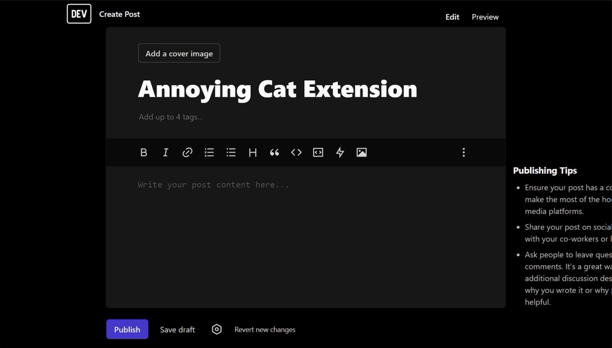

# Annoying Cat Extension

_The link to the full code for this article is at the end of this article._

Once upon a time I was involved in adding an Easter egg to an application that once a year, on April 1, would cause a famous doge meme to slide out from the left side of the screen. When hovered over, the doge would hide, to come back after some time. It was hidden from serious people in production by a boolean flag, but the development team loved it.

So recently I thought why not create a bookmarklet or extension to get similar experience anywhere, any time? In the end I decided to go with browser extension, since packing an image as base64 into a bookmarklet makes it too big to be used as a bookmarklet and would only work when pasted into browser's console, I also decided I would want to make it more flexible this time, with the image sliding from random side of the screen, left, right, top or bottom.

Now, I do not have a doge meme dog to take a picture of, but I still have a picture of my cat peeping out of a box, which looks perfect for this type of thing, though the approach I intend to use during the implementation will not rely on the image dimensions, so any picture would do really.


Being a developer, removing the background on the image was the hardest part, but I digress.

First we create a folder for the extension and add the assets folder and the image to it, i.e. in `assets/annoying-cat.png`. Having a folder is not necessary, but it keeps things neat and tidy. Also, storing the image as a file compared to base64 string in the javascript file is also less messy when it comes to reading the code.

The next step is to add `manifest.json`, which should have `web_accessible_resources` section to allow using the image from assets:

```json
{
  "manifest_version": 3,
  "name": "Annoying Cat",
  "version": "1.0",
  "description": "Annoys you.",
  "permissions": [
    "activeTab"
  ],
  "content_scripts": [
    {
      "matches": ["<all_urls>"],
      "js": ["content.js"]
    }
  ],
  "web_accessible_resources": [
    {
      "resources": ["assets/annoying-cat.png"],
      "matches": ["<all_urls>"]
    }
  ]
}
```

I don't create browser extensions too often, so I had to look it up, as I originally went with relative image path and failed miserably.

Now for `content.js`, I decided not to just pile all the code there, but put it inside an IIFE in case I ever want to extract it for a bookmarklet or to paste it into console. As a tribute to ~~real~~ other programming languages, I decided to call it main:

```javascript
(function main() {
    /** here be annoying cat */
})()
```

First of all, let us add some basic stuff, like enumeration to determine direction from which the image is going to appear as well as the css classes we use to manipulate it:

```javascript
const DIRECTIONS = {
    TOP: 3,
    RIGHT: 1,
    BOTTOM: 2,
    LEFT: 4,
};

const CSS_CLASSES = {
    IMAGE: 'annoying-cat-image',
    SHOW: 'annoying-cat-image-show',
    HIDE: 'annoying-cat-image-hide',
};
```

To utilize those classes, we need to create them and attach to the document's head. Let's make the image positioned fixed, with ridiculous z-index and outside the viewport initially, with some transitions for sliding out and hiding (this will happen when the image receives mouse over event).

```javascript
function addStyles() {
    const style = document.createElement('style');
    style.innerHTML = `
    .${CSS_CLASSES.IMAGE} {
        position: fixed;
        left: -100vw;
        top: -100vh;
        z-index: ${Number.MAX_SAFE_INTEGER}
    }
    
    .${CSS_CLASSES.HIDE} {
        transition-property: top, bottom, left, right;
        transition-duration: 0.2s;
        transition-timing-function: ease-out;
    }
    
    .${CSS_CLASSES.SHOW} {
        transition-property: top, bottom, left, right;
        transition-duration: 1s;
        transition-timing-function: ease-out;
    }`;
    
    document.head.appendChild(style);
}
```

Creating the image itself and adding source to it can be done using a couple of functions, I like to separate setting the source, because it might be URL or base64, which makes it easier to change if it is a separate function:

```javascript
function createImage() {
    const el = document.createElement('img');
    el.src = getImageSource();
    el.classList.add(CSS_CLASSES.IMAGE);
    document.body.appendChild(el);
    return el;
}

function getImageSource() {
    return chrome.runtime.getURL('assets/annoying-cat.png');
}
```

As we do not want to have the image sliding out from the same spots, we need a function to get random numbers, so we can get the random side, and the left offset if it is top/bottom or top offset if it is left/right. This means our function would have to be able to generate a random number between two given values:

```javascript
function getRandomNumber(max, min = 1) {
    const minCeiled = Math.ceil(min);
    const maxFloored = Math.floor(max);
    return Math.floor(Math.random() * (maxFloored - minCeiled + 1) + minCeiled);
}
```

Having this function we can create a function that generates a random direction, since our directions are a range from 1-4, we need a random number in that range:

```javascript
function getDirection() {
    return getRandomNumber(4);
}
```

Now, for an interesting part: since we do not want to rely on hard-coding width/height of the image, but calculating them on the fly, we cannot completely hide it, or those values would be 0, we would have to set the image's visibility to hidden instead. Moreover, since the image is going to appear from a random side and position, it means we would have to reposition it before changing its visibility to visible and allowing its appearance via css classes with transitions. This means the invisible image will be flying through the screen at some point.

In order to avoid awkward situation with flying image becoming visible before we want it to, let us delegate this event to a function, which would add the show class to the image, adjust its visibility and perform a callback to set its other properties, which will vary, depending on the side of the screen, from which the image appears:

```javascript
function show(slideCb) {
    setTimeout(() => {
        img.classList.add(CSS_CLASSES.SHOW);
        img.style.visibility = 'visible';
        slideCb();
    }, 1000);
}
```

To handle all 4 cases for each screen side, we can add 4 function to handle each case (could probably be reduced to 1), they are rather similar in structure, they reposition the image and set properties for it to slide out ~~annoyingly~~.

The pattern is the following: we position the image behind the side, from which it is supposed to emerge, rotating it accordingly, get random position for its left or top offset and showing it with a delay. Note the usage of `window.getComputedStyle` to dynamically obtain its width and height.

```javascript
function slideFromTop(img) {
    img.style.visibility = 'hidden';
    img.style.transformOrigin = 'unset';
    img.style.top = -1 * window.getComputedStyle(img).height.replace('px', '') + 'px';
    img.style.left = getRandomNumber(window.innerWidth - window.getComputedStyle(img).width.replace('px', '')) + 'px';
    img.style.transform = 'scaleY(-1)';
    show(() => {
        img.style.top = '0';
    });
}

function slideFromBottom(img) {
    img.style.visibility = 'hidden';
    img.style.transformOrigin = 'unset';
    img.style.top = 'unset';
    img.style.left = getRandomNumber(window.innerWidth - window.getComputedStyle(img).width.replace('px', '')) + 'px';
    img.style.transform = 'scaleY(1)';
    img.style.bottom = -1 * window.getComputedStyle(img).height.replace('px', '') + 'px';
    show(() => {
        img.style.bottom = '0';
    });
}

function slideFromLeft(img) {
    img.style.visibility = 'hidden';
    img.style.transformOrigin = 'left top';
    img.style.top = getRandomNumber(window.innerHeight - window.getComputedStyle(img).width.replace('px', '')) + 'px';
    img.style.transform = 'rotate(90deg)';
    img.style.left = -1 * window.getComputedStyle(img).height.replace('px', '') + 'px';
    show(() => {
        img.style.left = window.getComputedStyle(img).height;
    });
}

function slideFromRight(img) {
    img.style.visibility = 'hidden';
    img.style.transformOrigin = 'right top';
    img.style.top = getRandomNumber(window.innerHeight - window.getComputedStyle(img).width.replace('px', '')) + 'px';
    img.style.left = 'unset';
    img.style.transform = 'rotate(-90deg)';
    img.style.right = -1 * window.getComputedStyle(img).height.replace('px', '') + 'px';
    show(() => {
        img.style.right = window.getComputedStyle(img).height;
    });
}
```

With these handlers ready, it is time to write a function that would call the appropriate handler, for the given direction:

```javascript
function slideOut(img, dir) {
    img.classList.remove(CSS_CLASSES.HIDE);
    img.classList.add(CSS_CLASSES.SHOW);
    if (dir === DIRECTIONS.TOP) {
        slideFromTop(img);
    } else if (dir === DIRECTIONS.BOTTOM) {
        slideFromBottom(img);
    } else if (dir === DIRECTIONS.LEFT) {
        slideFromLeft(img);
    } else if (dir === DIRECTIONS.RIGHT) {
        slideFromRight(img);
    }
}
```

Showing image is only a part of our intention, we also need a function to reset it back to hiding, with a fast transition:

```javascript
function reset(img, dir) {
    img.classList.remove(CSS_CLASSES.SHOW);
    img.classList.add(CSS_CLASSES.HIDE);
    const offset =
      -1 * window.getComputedStyle(img).height.replace("px", "") + "px";
    if (dir === DIRECTIONS.TOP) {
      img.style.top = offset;
    } else if (dir === DIRECTIONS.BOTTOM) {
      img.style.bottom = offset;
    } else if (dir === DIRECTIONS.LEFT) {
      img.style.left = offset;
    } else if (dir === DIRECTIONS.RIGHT) {
      img.style.right = offset;
    }
}
```

The function to make image slide out from random direction can be crafted using a factory, which accepts the image itself and a cooldown timer:

```javascript
function createSlideOutFunction(img, showUpCoolDown) {
    let slideDirection;
    
    return () => {
        reset(img, slideDirection);
        setTimeout(() => {
            slideDirection = getDirection();
            slideOut(img, slideDirection);
        }, showUpCoolDown);
    };
}
```

With all needed functions in place, all that is left is to evoke them in a proper sequence:

```javascript
  addStyles();

  const img = createImage();
  // annoy every 2 seconds
  const showUpCoolDown = 2 * 1000;
  const slideOutRandomly = createSlideOutFunction(img, showUpCoolDown);
  img.addEventListener("mouseenter", slideOutRandomly);
  slideOutRandomly();
```

Now the unpacked extension can be loaded in chrome :)

The source code is available on [github](https://github.com/Bwca/browser-extension_annoying-cat).