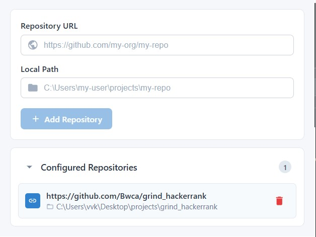
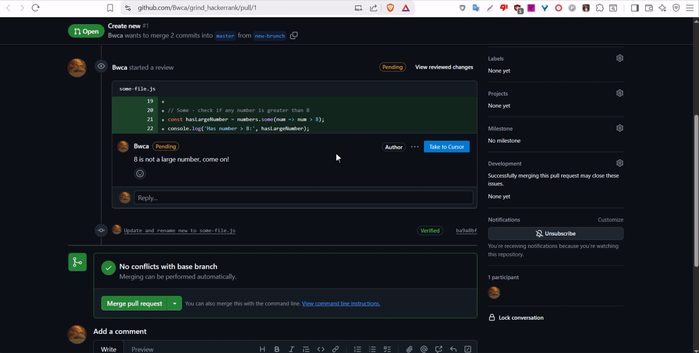

```ic-metadata
{
  "name": "Automating Addressing Pull Request Comments with AI",
  "series": null,
  "date": "2025-10-24",
  "lastModifiedDate": "2025-10-24",
  "author": "Volodymyr Yepishev",
  "tags": ["typescript", "ai", "automation"],
  "canonicalLink": "https://dev.to/bwca/automating-addressing-pr-comments-with-ai"
}
```

# Automating Addressing Pull Request Comments with AI

Perhaps one of the most common tasks a Frontend Developer gets, is adding a button from time to time. It always sounds ridiculously simple, nothing can go wrong and it is always just a button. _We need to add a button that_... and days of work follow, integrations come in, migrations, state management. Yet, it is merely a button, how hard can it be to add one?

Ironically this time it was me, who came up with the thought of adding a button. Any time a comment was made on a pull request, I had to copy the file path to open it in IDE to address or look it up. If I only had a button that does it, if I only had one...

So I started thinking: to add a button I would obviously need a browser extension with appropriate permissions to modify the page, yet starting the IDE it would have to be able to communicate with the operating system, which is not something that is possible. However, what an extension can do is perform http requests, which is very convenient and familiar to me, as a frontend developer.

My magic button application would require two components: the server side running on the computer and the browser extension, communicating via REST. The initial idea was to have _Send to Cursor_ button placed near every comment in a pull request, which would trigger the IDE to open specific file. Placing the button on a comment and extracting the file path posed no challenge, but how would the server side know which file path on the operating system corresponds to the file in the pull request? Easy, add a popup to the extension and let user set correlations between repo URL and local repo path, i.e.
`https://github.com/Bwca/grind_hackerrank`

corresponds to local

`C:\Users\vvk\Desktop\projects\grind_hackerrank`



Having this relation we can figure out the full path to the file in question and send it to the backend to open inside IDE with the following payload

```typescript
{
  "filePath": string,
  "comment": string,
  "codeSnippet": string,
  "autoSubmit": boolean
}
```

Where `codeSnippet` is the code being commented on and `autoSubmit` the flag to indicate whether the backend needs to submit the comment to IDE immediately, or merely paste it into the chat window of `Cursor`.

The flow is the following: the user navigates to a pull request in `Azure` or `GitHub` and has new button to resolve in `Cursor` added to every comment there. They click the button and the comment is transferred from the PR directly to their IDE into the `Cursor` chat window, where they can either submit it immediately, or modify and submit. The backend would need to handle both cases when there is no instance of IDE running or there are multiple instances running and an appropriate one needs to be chosen. Also, the file should not be opened individually, but in the context of an appropriate git repository.

Although it was tempting to use `js`/`ts` for the backend to keep one language, the superior tools available in `Python` have made me choose `Flask` over `NestJS` for my backend. It allowed opening IDE, choosing the correct one if several were open, maximizing it and even simulating user interacting with it (which is something `ChatGPT` refused to help me with, you are NoFun-GPT).

Some vibe coding magic and voilà, I got myself a spaghetti solution on Windows, that might look like a Frankenstein monster and have filthy architecture, yet it is a working tool that gets the job done.

As a bonus I added a button to streamline `Coderabbit` suggestions for AI agents, which in addition to pasting the suggestion immediately submits it in `Cursor`, though I tested it only in `Azure`.

I called it `CursIt` ~~because I curse at PR comments~~ short for `Cursor it`.



As usual the [source code](https://github.com/Bwca/browser-extension_cursit).

It is such an amazing experience to engineer something from scratch to solve a problem. Especially when aiming to support different platforms via abstraction.

Perhaps, the true lesson for me here is a browser extension can be turned into a real bridge between a web page and a local application.
