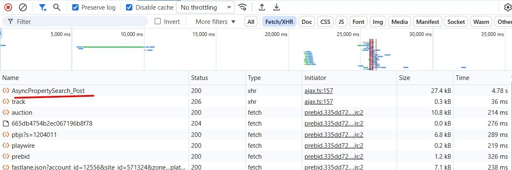
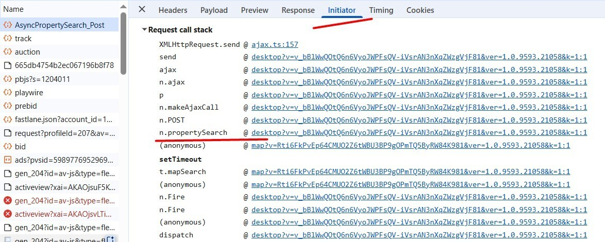
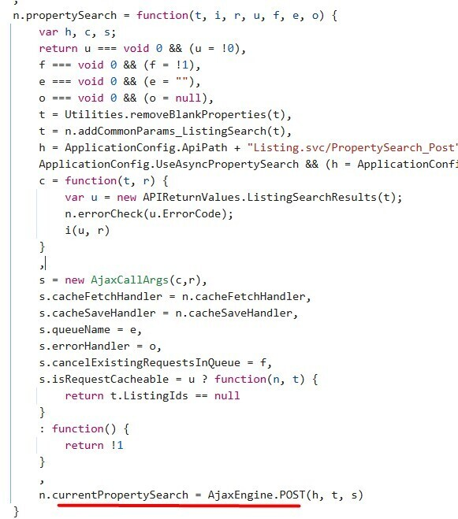
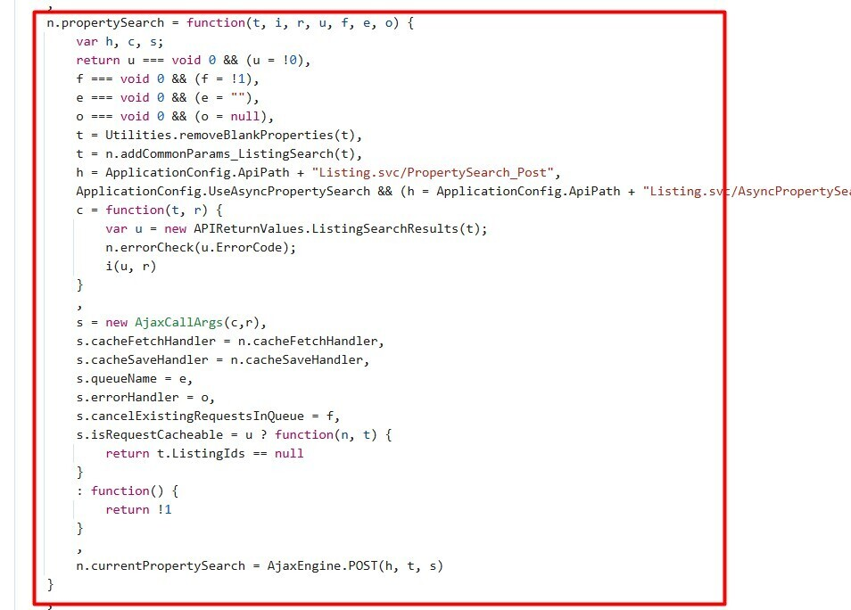
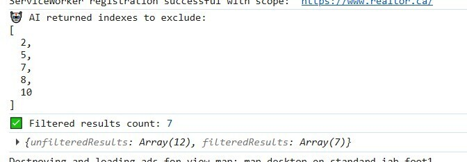
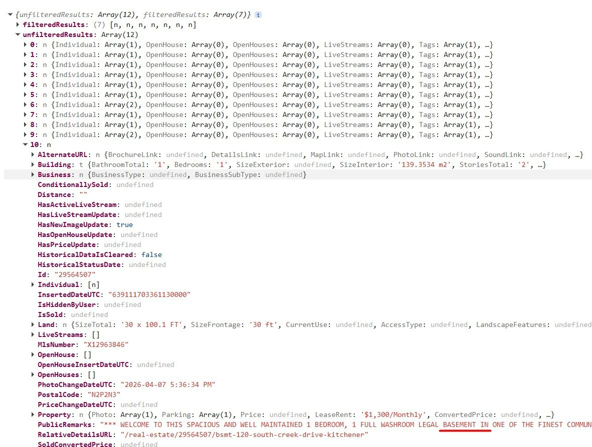

```ic-metadata
{
  "name": "Shape Your Own UX with AI",
  "series": null,
  "date": "2026-04-09",
  "lastModifiedDate": "2026-04-09",
  "author": "Volodymyr Yepishev",
  "tags": ["ai", "howto", "frontend", "hobby"],
  "canonicalLink": "https://dev.to/bwca/shape-your-own-ux-with-ai-4khn"
}
```

# Shape Your Own UX with AI

Someone once said everyone is a developer now. However hyperbolic the statement might be, modern AI tools have made production of code more accessible. The emphasis here is on the production of code and not actual meaningful applications, because this is in fact something a layman could utilize in the everyday life.

In this article we will take a look how any website UX can be enhanced and modified by virtually anyone, using free and readily available AI tools. You no longer need to wait and hope for developers to make the change: you're the developer now, fix it yourself. Of course, you could also ruin your UX trying, but it will be fun.

The tools we will use be used: a Chrome browser with built-in AI (if you want to add some features using AI, otherwise any browser that supports server response overrides) and any AI that can understand and produce code.

For this particula tutorial we will be focusing enhancing filters: many websites that contain listings provide filters, which are sometimes, if not always, far from perfect. Sometimes they are too broad and do not align with the user's interest. For example: you are looking for Ceylon cinnamon and search results include Cassia cinnamon, you are looking for an apartment for rent and get basements instead. How could this be enhanced? By simply rewriting the existing UI source code. Before AI this would be a challenging task due to minifcations and obfuscations, yet with AI it is rather trivial.

As an example I will be showcasing a real estate website filter enhancement to omit certain results from its search using AI, namely I will be filtering out anything that is a basement, which is not an option in the form filters. Since the tutorial is targeting recreational coders, I will try to keep it simple and not too technical. It is more the concept that you need to grasp how to do it, than to learn a specific technique, as those would vary based on your target. It takes six steps in total.

## Step one: locate the request containing results you want to filter.
Most websites don't do full page reloads nowadays, doing REST calls to fetch additional data. Proceed to the target, navigate to the page with the listing you want to view. Open developer tools, navigate to the network tab and set the filter to XHR. It is a bother to browse through all requests to find the one you need, so clear results. Once results are cleared, we need to trigger a new call to the search to find out our search request in the network tab. The easiest way is usually to navigate to the next page in the list. Check the request and response to make sure the target request has been detected. Usually you you can tell by the name of the request what it does, in my case it is property search:


## Step two: locate the code consuming the results.
Enhancing filters means there will be a filter in the middle between the response and a consumer. In order to locate it we need to check the initiator tab and figure out who the caller was. Note that the consuming code is not always the first in the list. Do some research or make a screenshot and ask AI to deduct it. It is sometimes very obvious which code is the consumer, i.e. here the method name gives it out:


Once located, find the line in the code that triggers the call in the initiator chain and look for the assignment operation using =. If you are lost, copy all the code between two curly braces and ask AI to figure out where the search results are assigned, while it burns some trees.


## Step three: add the file to overrides
Anything that gets executed by a website is done by your computer. The server sends you the files that your computer proceeds to run. Now that you know the file containing the code you want to modify, you need to override it. This is done by right clicking the file and selecting override content. The browser will prompt you to confirm you know what you're doing (do you?) and select a folder to store the overrides. Once the file has been added to the local overrides, it is the time to write some code.

## Step four: figure out the model and decide on the filter
Most likely you have noted the code in the file looks unreadable. This is because the code is often minified and/or obfuscated before it is shipped to the client. Locate the function or method that contained the initial code calling the search, usually between two curly braces. I.e. I will be overwriting the whole method that gets the search results and passes them:


If unsure which fragment to rewrite, throw the screenshot at AI, trees need that CO2. What you might also want to do is to ask it to add logging of the search results, so you could provide better input for it. Once you have the response data model, share it with AI and decide based on what you want to filter: would it be filtering out based on a word? Share the code with AI and ask it to add filtering based on your request, copy the code snippet back to the overridden file and save. Reload the website to see if everything works as intended and iterate with AI until you get the desired outcome. In my case I figured filtering by `PublicRemarks` would be the best approach.

## Step five (optional): use the Chrome built-in AI.
Regular text filters might not work very well if they encounter a word salad: a basement might not be a basement, but a bright lower-level unit or something like that. This is where AI comes to help. Initiate a session with the build-in AI and pass to it search results along with the prompt how they need to be filtered. I.e. here I added logging and AI filteing to the original method, so that it removes anything that looks like a basement "appartment":

```js
n.propertySearch = function(t, i, r, u, f, e, o) {
    var h, c, s;

    u === void 0 && (u = !0);
    f === void 0 && (f = !1);
    e === void 0 && (e = "");
    o === void 0 && (o = null);

    t = Utilities.removeBlankProperties(t);
    t = n.addCommonParams_ListingSearch(t);

    h = ApplicationConfig.ApiPath + "Listing.svc/PropertySearch_Post";
    ApplicationConfig.UseAsyncPropertySearch &&
        (h = ApplicationConfig.ApiPath + "Listing.svc/AsyncPropertySearch_Post");

    console.log("🌐 PropertySearch POST URL:", h);
    console.log("📤 Payload:", t);

    c = async function(t, r) {
        console.log("📥 Raw response:", t);
        console.log("📦 Raw secondary:", r);

        var uRes = new APIReturnValues.ListingSearchResults(t);
        console.log("✅ Parsed result:", uRes);

        n.errorCheck(uRes.ErrorCode);

        // --- AI integration starts here ---
        try {
            if ('LanguageModel' in self) {
                const availability = await LanguageModel.availability();

                if (availability !== 'unavailable') {
                    const session = await LanguageModel.create();

                    const remarks = (uRes.Results || [])
                        .slice(0, 20)
                        .map(item => item.PublicRemarks || "");

                    // 🔒 EXACT ORIGINAL QUERY (UNCHANGED)
                    const userQuery = "Exclude any basement units or basemen apartments";

                    // 🔒 EXACT ORIGINAL PROMPT (UNCHANGED)
                    const prompt = `
                        You are a real estate assistant.                        
                        Given the following property descriptions, identify which listings are basement units, lower units or basements for rent and should be excluded.
                        Output ONLY a VALID JSON array of the zero-based indexes of listings that are basement units or basemen apartments.                        
                        Query: "${userQuery}"                        
                        Listings:
                        ${JSON.stringify(remarks, null, 2)}
                    `;

                    let aiResult = await session.prompt(prompt);

                    // ✅ non-invasive safety (does NOT change behavior)
                    if (typeof aiResult === "string") {
                        aiResult = aiResult.replace(/```(json)?/g, '');
                    }

                    console.log("🤖 AI returned indexes to exclude:", aiResult);

                    let indexesToExclude = [];

                    try {
                        const parsed = JSON.parse(aiResult);

                        // preserve behavior: only accept valid array
                        if (Array.isArray(parsed)) {
                            indexesToExclude = parsed;
                        } else {
                            throw new Error("Expected JSON array");
                        }
                    } catch (parseError) {
                        console.warn("⚠ Could not parse AI indexes output, defaulting to no exclusions");
                        indexesToExclude = [];
                    }

                    // 🔒 EXACT ORIGINAL BEHAVIOR PRESERVED
                    // (you intentionally disabled filtering)
                    const filteredResults =  (uRes.Results || []).filter((_, idx) => !indexesToExclude.includes(idx));

                    console.log("✅ Filtered results count:", filteredResults.length);
                    console.log({
                        unfilteredResults: uRes.Results,
                        filteredResults,
                    });

                    uRes.Results = filteredResults;
                }
            }
        } catch (aiError) {
            console.error("❌ AI error:", aiError);
        }
        // --- AI integration ends here ---

        i(uRes, r);
    };

    s = new AjaxCallArgs(c, r);
    s.cacheFetchHandler = n.cacheFetchHandler;
    s.cacheSaveHandler = n.cacheSaveHandler;
    s.queueName = e;
    s.errorHandler = o;
    s.cancelExistingRequestsInQueue = f;

    s.isRequestCacheable = u
        ? function(n, t) {
            return t.ListingIds == null;
        }
        : function() {
            return !1;
        };

    n.currentPropertySearch = AjaxEngine.POST(h, t, s);
}
```

Now I have a clear picture how many basements were excluded in the console:


Unfiltered results are there for debug and make sure everything works properly:


Do not expect to get everyhing working in one go, you might need to do some iterating until you get the best UX you want.

## Step six (important): do not close the developer tools.
Having developer tools open is the requirement for the overrides to work, so once closed, all your code turns into a pumpkin. Until you reopen them.

Have fun personalizing your browsing experience. The devs will push updates and break all your changes :)
